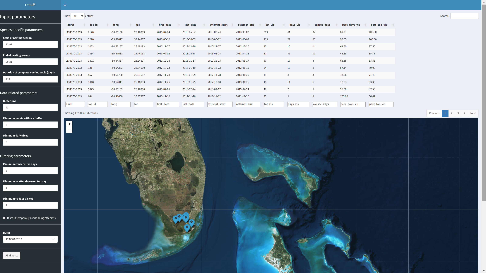

```{r setup, include = FALSE}
knitr::opts_chunk$set(
  collapse = TRUE,
  comment = "#>"
)
```

<script type="text/javascript">
  // When the document is fully rendered...
  $(document).ready(function() {
    // ...select all header elements...
    $('h1, h2, h3, h4, h5').each(function() {
      // ...and add an id to them corresponding to their 'titles'
      $(this).attr('id', $(this).html());
    });
  });
</script>
    
```{r packages, echo = FALSE}

library(kableExtra)

```


## Introduction

The `nestR` package provides functions to locate nesting attempts and estimate their outcome from bird GPS-tracking data. Being able to estimate reproductive outcome from GPS data bridges the gap between movement and fitness. 

This vignette presents the workflow of the `nestR` package. The workflow can be conceptually divided in two parts: [first](#part1), the identification of nesting attempts along individual movement trajectories, and [second](#part2), the estimation of the outcome of nesting attempts. 

For illustration purposes, this vignette uses example datasets on three bird species: wood storks (*Mycteria americana*), lesser kestrels (*Falco naumanni*), and mediterranean gulls (*Ichthyaetus melanocephalus*). Each dataset includes trajectories for two individual-years. All example datasets are available within the package. 

## Data format

Functions in the `nestR` package require GPS data to be formatted as a  `data.frame` including four columns: 

* `burst` - this is a unique identifier of each individual-year. We recommend the user to split individual data into bursts on a date that does not overlap with nesting activities. The full breeding cycle of an individual on a given year needs to be comprised within a single burst. 

* `date` - this is a date-time object of class `POSIXct`. 

* `long` and `lat` - these are location coordinates in long/lat projection.

Additional columns will not interfere with the functioning of the package, as long as these four fields are present and named with the terms above. 

Let's load the package and take a look at the wood stork dataset, for example:


```{r look at the data, message = FALSE}

# Load the package
library(nestR)

# Load wood stork dataset
data(woodstorks)

# Take a look
head(woodstorks)

# Data structure 
str(woodstorks)

```

## Part I: Finding nest locations {#part1}

### Background 

When birds are nesting, they exhibit specific movement patterns that can allow us to identify the location of their nest. Specifically, birds perform repeated back-and-forth movements to and from their nest while they provide food for their nestlings and themselves. Repeatedly visited locations can be identified along movement trajectories, and patterns of revisitation can be used to determine whether a location that gets visited repeatedly is likely to be a nest. 

The process of identifying nesting locations from GPS data relies on two components: knowledge of the biology of the study species and characteristics of the data at hand. Both of these aspects are fundamental in driving the patterns we observe in movement trajectories and require careful consideration by the user. 

The datasets included in the `nestR` package differ both in terms of species biology and data characteristics. The following table summarizes the main differences:


```{r table, echo = FALSE}

ws <- c("woodstorks", "1 hour", "18 meters", 
        "Solar powered", "High", "Birth/non-breeding", "110 days",
        "Nov-Aug (varies with latitude)", "No", "Yes")
lk <- c("kestrels", "15 minutes", "~10 meters", 
        "Solar powered", "Low", "Incubation", "60 days",
        "Apr-Jul", "Yes", "No")
mg <- c("gulls", "15 minutes", "~10 meters", 
        "Solar powered", "Low", "Incubation", "60 days",
        "Apr-Jul", "No", "Yes")

datasets_table <- rbind(ws, lk, mg)
rownames(datasets_table) <- NULL
colnames(datasets_table) <- c("Dataset", "Time resolution", "Spatial resolution",
             "Battery type", "Failure rate", "Tagged at", 
             "Nesting cycle", "Nesting season", "Behavioral dimorphism",
             "Repeated attempts")

kable(datasets_table) %>%
  kable_styling(bootstrap_options = c("striped", "bordered"),
                font_size = 12, position = "center") %>% 
  add_header_above(c(" " = 1, "Data characteristics" = 5, "Species biology" = 4))

```


Throughout this vignette, we will refer back to specific features of each dataset and illustrate how these can and need to be accounted for when using functions in the `nestR` package. 

### Introducing the `find_nests` function

The central function for the first part of the `nestR` workflow is `find_nests`. This function identifies potential nests based on patterns of location revisitation. It takes as input the GPS data and returns any revisited locations that match a set of user-defined parameter values, along with a revisitation history for each of those locations. Parameters can be conceptually organized in three groups:

* Parameters related to basic information on the biology of the species;
* Parameters related to data characteristics; 
* Parameters used for discriminating nests from other repeatedly visited locations that are not nests.

Typically, while prior information on the first two is available to the user, this is not the case for the third group of parameters. Therefore, our recommended workflow for finding nests involves the following steps:

1. Identifiying any recurrently visited locations along individual movement trajectories;
1. Comparing revisitation patterns at nests versus non-nests and establish a way to tell them apart;
1. Based on what found in step 2, identifying nests among revisited locations.

The function `find_nests` will be used to tackle steps 1 and 3. 

To accomplish step 2, some information on the location of nests for a subset of the data is necessary. In an ideal situation, the user has access to prior information on the location of nests for some individual-years in the dataset. Otherwise, a viable alternative is for the user to identify "trusted nests"  among revisited locations through visual inspection, for example because they  fall within known colonies. Both cases will be illustrated [later on](#step2).

Here's the full list of arguments of the function `find_nests`:

* `gps_data`
* `sea_start`
* `sea_end`
* `nest_cycle`
* `buffer`
* `min_pts`
* `min_d_fix`
* `min_consec`
* `min_top_att`
* `min_days_att`
* `discard_overlapping`

The first argument is the GPS data, formatted as described in [Data format](#data-format). 

The next three arguments describe basic information of the biology of the  species: 

* `sea_start` and `sea_end` delimit the start and end of the breeding season for the species at hand. Restricting the scope of the analysis to the breeding season only is especially important for reducing computation time and avoiding incurring into memory issues when running `find_nests`. 

* `nest_cycle` is the duration in days of a complete nesting attempt for the species at hand. Typically, it counts how many days go by, on average, between the moment an individual starts building its nest and the moment its chicks fledge. 

The next three arguments are related to data characteristics: 

* `buffer` defines the spatial scale at which revisitation patterns will be calculated. Returns to a location are defined as returns to a circular area of radius = `buffer` (in meters). The use of this parameter is meant to account for the spatial scattering of GPS points around a nest due to both behavior (sometimes the tag will happen to record a point when the bird was in the proximity of the nest, possibly arriving or departing, and not exactly on it) and GPS error. The value of `buffer` needs to be set to a number at least as large as the spatial resolution of the GPS data. 

* Revisitation stats will be computed on each area of size `buffer` that is visited multiple times. To speed up calculations, the user can discard isolated points from the get-go and not bother calculating revisitation stats on those. The parameter `min_pts` allows to specify a minimum number of points that need to fall within a point's buffer for it to be retained in the calculation of revisitation stats. 

* Some of the revisitation stats included in the output of `find_nests` are based on the number of consecutive days a location is visited. For tags that have a high failure rate and a relatively low temporal resolution, it is easy to miss a nest visit even though it happened. This can break an otherwise continuous strike of days where visits were recorded. The argument `min_d_fix` allows the user to counteract the effect of missed visits, by setting a minimum number of fixes that need to be available in a day when no visit was detected for that day to be truly counted as non visited. In [the next section](#step1), we provide an example of when this is especially needed.

The remaining arguments are used for filtering revisited locations based on revisitation patterns: 

* Revisitation patterns include the number of consecutive days a location is visited, the percent of fixes at the location on the day with maximum attendance, and the percent of days a location is visited between the first and last visit. The user can set minimum values for each of these using `min_consec`, `min_top_att`, and `min_days_att`, respectively. Any location for which revisitation patterns do not exceed these user-defined thresholds will not be returned. Prior information regarding these parameters is likely not available to the user, and finding the best set of values to specify for these arguments will be the focus of [Step 2](#step2). 

* Finally, `discard_overlapping` specifies whether the function should return all the revisited locations that  match the specified criteria, or avoid returning  locations for which the time ranges of revisits are overlapping. Assuming that a bird cannot nest in two places at the same time, if `discard_overlapping` is set to `TRUE`, only the most likely nest location is return among temporally overlapping ones. However, we will later illustrate the case where it is useful to set this argument to `FALSE` instead.

The output of `find_nests` is a list with two elements: `nests` and `visits`. The first element, `nests`, is a `data.frame` including any revisited locations that match the criteria specified in the function arguments, along with their revisitation stats. For example:

```{r output example nests, echo = FALSE}

data(wost_output_1)

wost_output_1$nests %>% 
  group_by(burst) %>% 
  slice(1) %>% 
  as.data.frame()

```

Each row of the `data.frame` corresponds to one revisited location. The columns
are:

* `burst`, the burst id of the individual-year;
* `loc_id`, the unique identifier of the location;
* `long` and `lat`, its coordinates;
* `first_date` and `last_date`, the days when the location was first and last visited;
* `attempt_start` and `attempt_end`, the estimated start and end dates of the nesting attempt;
* `tot_vis`, the total number of visits (fixes);
* `days_vis`, the total number of days when the location was visited;
* `consec_days`, the duration of the longest strike of consecutive days when the location was visited;
* `perc_days_vis`, the percentage of days when the location was visited between the first and last visits;
* `perc_top_vis`, the percentage of fixes at the location on the day with  maximum attendance.

The days of first and last visit do not necessarily correspond to the start and end of a nesting attempt. If a bird visits the nest location before actually starting nesting, or returns to the nest after having completed the attempt, using the days of first and last visits as temporal limits of the attempt is going to be misleading. Since estimating the start and end dates of an attempt correctly will be critical for successfully estimating its outcome, `find_nests` takes into account the possibility of visits outside of the attempt, and cuts them out. The implementation is based on the value of `min_consec`: the attempt is estimated to start at the first occurrence of a strike of consecutive days at least as long as `min_consec`. Then, if the nest was visited for longer than the duration of a complete nesting attempt after that, the end date gets set at `attempt_start` + `nest_cycle`. If the last visit occurs before `attempt_start` + `nest_cycle`, then `attempt_end` is set to `last_date`. 

The second element of the list that `find_nests` returns as output is a `data.frame` named `visits`: this is essentially an updated version of the GPS data provided in input, with an additional column that flags any records taken at a nest with the location ID of that nest. This corresponds to the revisitation history of all nests listed in `nests`. This is what it looks like:

```{r output example visits, echo = FALSE}

data(wost_output_1)

wost_output_1$visits %>%
  slice(170:182) %>% 
  as.data.frame() 

```

### Step 1: Identifying recurrently visited locations {#step1}

Animals exhibit recursive movement patterns for a variety of reasons. In the  case of birds, locations that get visited recurrently can include nests as well as roosting sites, favorite foraging spots, and so on. However, patterns of  revisitation likely differ for locations that a bird visits for different  reasons. Nests are expected to be visited for longer strikes of consecutive  days, more consistently, or for longer or more times during a day compared to  other types of revisited locations. But *how much* more? It is our job to find  out. 

As a first step, we suggest using the `find_nests` function to screen the data to identify recurrently visited locations, regardless of whether they  are nests or not. To do so, the user can specify low values for the arguments involved with the filtering, so that the constraints applied are loose. 

Here is an example with wood storks. Wood storks nest at different times of the year in different parts of their range, so the first challenge with this species is that there isn't a well-defined nesting season. For example, wood storks in southern Florida usually breed between January and May, but those that nest in some areas farther north can start as late as March or April. Overall, we cannot exclude the possibility of observing nesting events any time between November and August. Therefore, we set `sea_start` and `sea_end` to November 1st and August 31st, respectively. The time required for an individual wood stork to complete its nesting cycle is 110 days. We set `nest_cycle` to this value.

The spatial accuracy of the GPS data for wood storks is 18 meters according to the tag user manual. We set the value of `buffer` to 40 meters to allow some  extra room for spatial scattering of points around a central location. In general, we found that buffer sizes between 20 and 50 meters return comparable results in our three case studies. We encourage the user to explore results obtained with different buffer sizes and possibly fine-tune the value to one that well captures the spatial scale of recursive movements given the species and data at hand. We set `min_pts` to 2 to avoid calculating revisitation patterns for points that are relatively isolated. This is still a very low, conservative value. 

We set `min_d_fix` to 5, meaning that any day with no visit does not get counted as interrupting an otherwise continuous strike of consecutive days if the tag did not collect at least 5 fixes on that day. This is especially important for wood storks because the time interval between fixes is 1 hour, the tags are solar powered and therefore only take fixes during the daytime, and the failure rate is high. These factors combined mean that often there are only a handful of fixes collected on a day, and the probability of missing nest visits is high. If a strike of consecutive days is interrupted by one or more days with no recorded visit but that only include 1 to 4 fixes, we do not have enough information to truly determine if the nest was not visited, and we assume that a visit was  likely missed instead. As we will mention later, this is not as much of a  problem in the case of both kestrels and gulls, because those tags were set to collect data every 15 minutes and have a low failure rate, so that the  probability of missing visits to the nest is lower. 

We set the three filtering arguments to low values, meaning that the constraints we enforce are as loose as they can be. We set `min_consec` to 2 days, and `min_top_att` and `min_days_att` to 1%. This will return any location that is visited for at least 2 consecutive days, regardless of how often it is visited between the first and last visit and regardless of how much is it visited for on the day with the most visits. We also set `discard_overlapping` to `FALSE` so that the function will not discard locations that are visited simultaneously to a likely nest. This will be useful for [Step 2](#step2). 

```{r wost screening, eval = FALSE}

wost_output_1 <- find_nests(gps_data = woodstorks,
                    sea_start = 305,
                    sea_end = 243,
                    nest_cycle = 110,
                    buffer = 40,
                    min_pts = 2,
                    min_d_fix = 5,
                    min_consec = 2,
                    min_top_att = 1,
                    min_days_att = 1,
                    discard_overlapping = FALSE)

```

Here is what the output looks like:

```{r print output, eval = FALSE}

head(wost_output_1$nests)

```

```{r print output for real, echo = FALSE}

data(wost_output_1)
head(wost_output_1$nests)

```

Let's check how many revisited locations were returned with this set of  parameters for each of the two individual-years:

```{r dim output 1}

table(wost_output_1$nests$burst)

```

Results are automatically sorted by `tot_vis` within each burst, so for each  individual the location that was visited the most is at the top of the list. 

### Step 2: Discriminating between nests and non-nests {#step2}

The set of revisited locations obtained as output of the screening in [Step 1](#step1) likely includes both nests and non-nests. The objective of this section is to identify the best set of parameter values to discriminate between these. Specifically, the parameters that we want to tune are those that describe patterns of revisitation: `min_consec`, `min_top_att`, and `min_days_att`. To inform our choice of values for these parameters, we want to compare the values obtained in output for nests and non-nests for `consec_days`, `perc_top_vis`, and `perc_days_vis`.

The function `get_explodata` automates the process of selecting nests and non-nests to compare. Given the output of `find_nests` and information on known nest locations, the function extracts the true nest and another location that is not a nest from the set of revisited locations. To illustrate how the function works, let's step through the process manually on the two individuals in the wood stork example dataset. 

#### Case A: coordinates of true nest are known

For one of the two wood storks, the location of the nest is known. This  individual bred at a colony located at the  Jacksonville Zoo, and we are lucky  enough to have the GPS coordinates of its nest. For this individual, thus, we  can identify the true nest among the set of revisited locations by comparing  coordinates to those of the known nest. We can then select another location  among the remaining to serve as a non-nest counterpart, and compare how values  of the parameters describing revisitation patterns differ between the two. 

Let's look at the first 10 revisited locations identified for this individual in the previous section: 

```{r jax}

head(wost_output_1$nests %>% filter(burst == "414590-2009"), 10)

```

The first location was visited a total of 348 times, for 76 days (of which 40 consecutive). The bird went back to the location on 54.68% of days between the day of first and last visit. On the day the bird spent the most time at the  location, 100% of the fixes were at the location. This seems like a good  candidate nest. Let's compare its coordinates to the ones of the known nest and see if they match. 

```{r known jax nest}

data(jax_known_nest)

jax_known_nest

```

The coordinates match until the third (longitude) and second (latitude) decimal  places. Let's see what distance that corresponds to:

```{r dist}

coords_cand <- wost_output_1$nests %>% 
  filter(burst == "414590-2009") %>% 
  slice(1) %>% 
  select(long, lat)

coords_known <- jax_known_nest %>% 
  select(long, lat)

geosphere::distGeo(coords_cand, coords_known)

```

The points are about 18 meters apart. That is well within what expected due to  both GPS error and behavioral patterns affecting the signal we get in the data, and well within the 40 meters buffer we used to calculate revisits. We can  confidently confirm that that is the nest. 

Now, we want to select a non-nest among the other revisited locations. We want to pick a location that we are confident is not a nest but that gets as close as possible to the revisitation parameters of a true nest. This will give us the most power to discern nests from non-nests. 

One way of going about this task would be to select the second most visited location in the set. The top visited location is not necessarily also the one with the  highest values for each of the other revisitation parameters, but usually the  total number of visits is a good predictor of how intensively a location gets revisited in all aspects. But how can we be sure that the second most visited location is not also a nest, maybe corresponding to a second nesting attempt?

Some species are known to be able to nest twice in the same breeding season if they start the first clutch early enough or if their first attempt fails. In this case, one way to be sure that the location we select is truly a non-nest is to choose one that temporally overlaps with the true nesting attempt at the known location. This is where having set `discard_overlapping = FALSE` in `find_nests` comes in handy, as it made sure that locations visited simultaneously to the true nest were still retained in our output. 

In the case of the Jacksonville stork, the nesting attempt at the true nest was estimated to start on March 3rd 2009 and end on June 22nd 2009. The second, third, fourth, and fifth location were all visited in a time range that does not overlap with that interval. The first instance of a location that was visited simultaneously to the true nest is the sixth location in the set. Since wood  storks are able to do repeated nesting attempts, we can choose to be conservative and select the fifth location as a non-nest to compare the nest to, rather than the second. 

The function `get_explodata` automates the process we described so far. It takes as input the list of candidate nests output by `find_nests`, and a data frame of coordinates for the known nests (`known_coords`). The argument  `pick_overlapping` allows the user to decide whether the criterion of temporal  overlap to a true nest gets applied or not when selecting a non-nest. For  species that do not re-nest, this might not be necessary. The function is also  designed to handle two possible sources of error that could arise from  automating the process instead of supervising it:

1. The true nest location is not in the output. This can happen if, for example, gaps in the data due to tag malfunctioning led to missing most of the visits to  the nest. 
1. Multiple locations surrounding the nest were selected as candidate nests, and the closest one to the nest in terms of linear distance is not the one with the highest revisitation parameters. 

Selecting the true nest as simply the closest location to the known nest is  prone to both of these error sources. The argument `buffer` in the function  `get_explodata` helps solving both of these issues. The function selects the  true nest as the top visited location among those that fall within a `buffer` distance from the known nest. If there is none, nothing is returned. If multiple locations are available within the buffer, the most visited one, not the closest one, gets selected. If the coordinates in `known_coords` represent the actual location of the nest, we recommend to set `buffer` in `get_explodata` to the same value used for the argument `buffer` in `find_nests`. In cases where, for example, a single pair of coordinates is available for an entire colony rather than for the exact location of a nest within it, the value of `buffer` can be increased to match the spatial extent of the colony to ensure the true nest does not fall outside of the buffer.

Here is the output of `get_explodata` for the Jacksonville stork:

```{r get explo stork 1}

output_stork1 <- wost_output_1$nests %>% 
  filter(burst == "414590-2009")

(explodata_stork1 <- get_explodata(candidate_nests = output_stork1, 
                                  known_coords = jax_known_nest,
                                  buffer = 40,
                                  pick_overlapping = TRUE))

```

The result of the automated process matches our expectations. 

#### Case B: coordinates of true nest are unknown

For the second individual in the wood stork example dataset, no prior  information is available on the location of the nest. However, we can identify the likely location of the nest by visually inspecting revisited locations in the output of `find_nests`. 

A useful tool available within `nestR` for visual exploration of the data is available with the function `explore_nests`. This function launches a shiny app that allows to interactively explore results of `find_nests` by visualizing them on a map. The app can be opened with RStudio or any browser software. Input parameters taken as arguments by `find_nests` can be manipulated on the spot and the corresponding results are displayed on a satellite map. 

By launching `explore_nests` on the wood stork data, selecting the burst 1134370-2013, and inputting the same parameters we used when running  `find_nests`, we notice that the first location of the set (the most visited one), falls right on the Rookery Branch colony in Everglades National Park.  This, together with the fact that the location was visited a total of 589 times, for 61 days (of which 37 consecutive), 89.71% of the days between the first and last visit, and 100% of the time on the day with maximum attendance, makes us confident that the location represents a true nest. 

```{r shiny, eval = FALSE}

explore_nests(woodstorks)

```

```{r screenshot1, echo = FALSE, fig.cap = "", out.width = '100%'}



```

```{r wost2}

wost_output_1$nests %>% 
  filter(burst == "1134370-2013") %>% 
  slice(1) 

```

```{r screenshot2, echo = FALSE, fig.cap = "", out.width = '100%'}

knitr::include_graphics("img/nestR_img2.jpg")

```

The function `get_explodata` allows to input information on true nests in an alternative way that works well in this case: instead of providing the nest coordinates by passing `known_coords` to the function, the user can provide the  location ID instead, by using the argument `known_ids`. We can thus run  `get_explodata` on wood stork 1134370-2013 by specifying the location ID of the point we trust to be a nest: 

```{r get explo stork 2}

output_stork2 <- wost_output_1$nests %>% 
  filter(burst == "1134370-2013")

id_known <- data.frame(burst = "1134370-2013",
                       loc_id = 2170)

(explodata_stork2 <- get_explodata(candidate_nests = output_stork2, 
                                  known_ids = id_known,
                                  pick_overlapping = TRUE))

```

#### Find set of parameter values to tell apart nests and non-nests

Once we have a dataset of nests and non-nests, we can compare values of revisitation parameters between those, and use that to inform the choice of  parameter values to filter nests among revisited locations. 

Several possible approaches are available to tackle this objective. Here, we present one possible implementation, based on Classification and Regression  Trees (CART). Functions to run a customized CART algorithm on the revisited location data are available within `nestR`, but we encourage the user to explore other implementation options or other analytical tools that may also be  appropriate for the task.

To run the CART, we are going to use a larger version of the exploratory dataset we built in the previous step for 2 wood storks. This is a simulated dataset including 200 bursts with one nest and one non-nest each. 

```{r show explodata}

data(explodata_storks)
head(explodata_storks)

```

We are going to use half of the data to train the CART and the other half to  test it. Classification accuracy should improve with the size of the training  dataset. In cases where data availability is limited, the choice of how much  data to use to train versus test the CART is based on a trade-off between  classification accuracy and the ability to cross-validate the tree and estimate  error rates. 

```{r set seed, echo = FALSE}

set.seed(22)

```

```{r cart example, fig.width = 7, fig.height = 6, fig.align = 'center'}

(ws_cart <- discriminate_nests(explodata=explodata_storks, train_frac=0.5))

```

The resulting tree shows that two criteria can help us tell nests apart from non-nests: a location needs to be visited for at least 15 consecutive days, for  at least 53% of days between first and last visit, and at least 85% of the time on the day the attendance is maximum to be a nest; or, if it is not visited for  at least 15 days, then the percent attendance on the top day needs to be at  least 94%. These criteria translate in the following sets of parameters:

* `perc_top_vis >= 85`, `perc_days_vis >= 53`, `cons_days >= 15`
* `perc_top_vis >= 94`, `perc_days_vis >= 53`

### Step 3: Identifying nests among revisited locations {#step3}

After having identified sets of parameter values that discriminate between nests and non-nests, we can make an informed decision on what values to use as input in the filtering arguments of `find_nests`. Since the CART identified two sets of independent conditions, we can run `find_nests` twice to obtain nests that respond to each set of criteria. In future versions of `nestR`, the user will be able to pass a list of filtering criteria to `find_nests` and obtain all results at once. For now, let's go ahead and run the function on the original wood stork dataset with the first set of filtering parameters:

```{r find nests 1, eval = FALSE}

wost_output_2 <- find_nests(gps_data = woodstorks,
                    sea_start = 305,
                    sea_end = 243,
                    nest_cycle = 110,
                    buffer = 40,
                    min_pts = 2,
                    min_d_fix = 5,
                    min_consec = 15,
                    min_top_att = 85,
                    min_days_att = 53,
                    discard_overlapping = TRUE)

```

Note that for all other arguments in the function (those related to the species  biology and to data characteristics) we are keeping the same values as we did  the first time. However, this time we are setting `discard_overlapping = TRUE`. We no longer need to retain overlapping nesting attempts in the output. 

```{r show output2, eval = FALSE}

wost_output_2$nests

```

```{r show output2 for real, echo = FALSE}

data(wost_output_2)
wost_output_2$nests

```

Good news! The function identified the known nest correctly for both burst 1134370-2013 and 414590-2009. However, it also identified a second location for burst 1134370-2013. This looks like a second, probably failed, nesting attempt. We know that after  leaving Rookery Bay, this wood stork migrated north to the Atlantic coast where its summer range is, and we cannot exclude that it attempted to nest a second  time there. 

Let's  see what happens with the other set of parameters:

```{r find nests 2, eval = FALSE}

wost_output_3 <- find_nests(gps_data = woodstorks,
                    sea_start = 305,
                    sea_end = 243,
                    nest_cycle = 110,
                    buffer = 40,
                    min_pts = 2,
                    min_d_fix = 5,
                    min_consec = 2,
                    min_top_att = 94,
                    min_days_att = 53,
                    discard_overlapping = TRUE)

wost_output_3$nests

```

```{r show output3 for real, echo = FALSE}

data(wost_output_3)
wost_output_3$nests

```

The correct nest for 414590-2009 was returned as well as the two nests we found with the previous set of parameters for 1134370-2013. In this case, all nests satisfied the criteria defined in both sets of filtering parameters. 

Since all nests were identified with both sets of parameters, there is no need to merge the two outputs. However, for 1134370-2013 at location 2170, the attempt start dates estimated with the first and second set of parameters differ. This is because the value of `min_consec` used in input differs between the two sets. Recall that `find_nests` sets the start of a nesting attempt to the first occurrence of a strike of consecutive days at least as long as `min_consec`, to avoid counting extra visits to the nest location as part of the attempt. Which output to choose is essentially a judgement call, which should once again be driven by knowledge of the species' ecology. Wood stork attendance at the nest is almost uninterrupted in the initial phase of nesting (during pair formation, nest building, and early incubation). Therefore, we expect that the longest strike of consecutive days we observe corresponds to the very beginning of a nesting attempt. Missed nest visits could be problematic in this case, but setting `min_d_fix` to a large enough value should make us feel relatively safe. Based on these considerations, we choose to retain the output obtained with the stricter threshold of `min_consec` - which corresponds to the shorter attempt duration. This choice will ensure a more conservative estimation of nesting outcome later on. 

The data on nesting attempts obtained as output of `find_nests` will be the starting point for the second part of the workflow, where we will estimate reproductive outcome. 

```{r merge outputs}

wost_nests <- wost_output_2

```

### Case studies: applying the method to different species and data

Coming soon...

## Part II: Estimating reproductive outcome {#part2}

### Work in progress...

```{r format data for outcome estimation}

wost_attempts <- format_visits(nest_info = wost_nests, nest_cycle = 110)

```


``` {r run JAGS, eval = FALSE}

#Using default MCMC parameters (mcmc_params)
wost_outcomes <- estimate_outcomes(fixes = wost_attempts$fixes, visits = wost_attempts$visits)

```

Note that the JAGS estimation is done using the coda* functions, so the coda diagnostics are available, e.g.,

``` {r coda diagnostics, eval = FALSE}

#Summary plot
plot(wost_outcomes)
#Trace plots
traceplot(wost_outcomes)
#Autocorrelation
autocorr.plot(wost_outcomes) #should thin by 5
#Posterior PDF
densplot(wost_outcomes)

```
