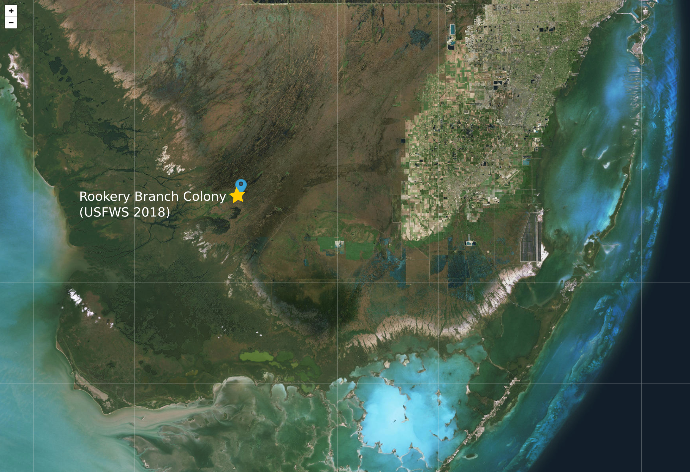

```{r setup, include = FALSE}
knitr::opts_chunk$set(
  collapse = TRUE,
  comment = "#>"
)
```

<script type="text/javascript">
  // When the document is fully rendered...
  $(document).ready(function() {
    // ...select all header elements...
    $('h1, h2, h3, h4, h5').each(function() {
      // ...and add an id to them corresponding to their 'titles' 
      $(this).attr('id', $(this).html()); //$
    });
  });
</script>
    
```{r packages, echo = FALSE}

suppressWarnings({
  suppressPackageStartupMessages({
    library(kableExtra)
    library(gridExtra)
  })
})

```
<!-- MB: Why not simply `include = FALSE` instead of the complicated nested functions? -->

## Introduction

The `nestR` package provides functions to locate nesting attempts and estimate their outcome from bird GPS-tracking data. 
<!-- MB: I would say "tracking data, e.g. from GPS tags" and then use tracking data for the generic usage (e.g. 'Data format' below) or GPS data for specific cases (e.g. WOST data). -->
Being able to estimate reproductive outcome from GPS data bridges the gap between movement and fitness. 
<!-- MB: It does not, at least not completely. Reproductive success is only one part of fitnesss. -->

This vignette presents the workflow of the `nestR` package. The workflow can be conceptually divided in two parts: [first](#part1), the identification of nesting attempts along individual movement trajectories, and [second](#part2), the estimation of the outcome of nesting attempts. 

For illustration purposes, this vignette uses example datasets on three bird species: wood storks (*Mycteria americana*), lesser kestrels (*Falco naumanni*), and mediterranean gulls (*Ichthyaetus melanocephalus*). Each dataset includes trajectories for two individual-years. All example datasets are available within the package. 
<!-- MB: Obviously the examples are replicable. But you may want to say it explicitly here, so people know right away. Also, are these trully real data? Same thing, you may want to say it explicitly. That adds weight to it I think. -->

## Data format

Functions in the `nestR` package require GPS data to be formatted as a  `data.frame` including four columns: 
<!-- MB: I have to mention that now: I don't think working on DF is a good idea. Better to rely on ltrajs here, because that relieves the burden of data checking from you. Read Rocío's review on R packages (you don't have to read the entire descriptions of every packages, but please read introduction and all parts after the listing). -->
<!-- MB: Also, that's where you can define tracking data as (x, y, t). -->

* `burst` - this is a unique identifier of each individual-year. We recommend the user split individual data into bursts on a date that does not overlap with nesting activities. The full breeding cycle of an individual on a given year needs to be contained within a single burst. 
<!-- MB: Almost nobody correctly understand the concept of a burst… If you rely on ltrajs, that's fine though. But you will have to offer utility functions to prepare the data into the correct bursts. Anyway, does the year have to be civil year? Or can be over two civil years (e.g. June 2017–June 2018)? You could provide an example for clarity. -->

* `date` - this is a date-time object of class `POSIXct`. 
<!-- MB: Can the 'time' part be empty? -->

* `long` and `lat` - the longitude and latitude of the locations.
<!-- MB: BTW, I hate when people use a dash like this. We invented colons for a reason. -->
<!-- MB: I see now from Matt's comments that lat/lon need to be in DD. Any reason why? -->

Additional columns will not interfere with the functioning of the package, as long as these four fields are present and named with the terms above. 
<!-- MB: I still recommend the use of ltraj. But in any case, you should never force users to reformat their data. In this case, you can simply use sane defaults but allow for any user-defined names: my_function(…, burst = "burst", date = "date", long = "long", …) -->

Let's load the package and take a look at the wood stork dataset, for example:


```{r look at the data, message = FALSE}

# Load the package
library(nestR)

# Load wood stork dataset
data(woodstorks)

# Take a look
head(woodstorks)

# Data structure 
str(woodstorks)

```
<!-- MB: Why do you start and end every chunk with an empty line? The starting line looks ugly on rendering. The last empty line is removed anyway… Generally speaking, add empty line only when it makes sense. If you need to pause in the code, to me, that's a sign that you need to cut it into different chunks. -->
<!-- MB: I'm also not a big fan of rendering comments in R code. Comments in the code should be for developers (you and others), not for users. You can keep it there if you want, but not render it. If you need to say something about some code, say it in the text, and break the chunks in smaller pieces if needed. -->
<!-- MB: Finally, you need help files for data as well… -->


## Part I: Finding nest locations {#part1}

### Background 

When birds are nesting, they exhibit specific movement patterns that can allow us to identify the location of their nest. Specifically, birds perform repeated back-and-forth movements to and from their nest while they provide food for their nestlings and themselves. Repeatedly visited locations can be identified along movement trajectories, and patterns of revisitation can be used to determine whether a location that gets visited repeatedly is likely to be a nest. 
<!-- MB: I think that here, you need to really strengthen the background. What is specific to nesting birds? Is this approach (or part of it) also replicable for all central-place foragers for instance? How does this compare to identification of kill sites for instance? Or ungulates giving birth? Don't hesitate to add references here. -->

The process of identifying nesting locations from GPS data relies on two components: knowledge of the biology of the study species and characteristics of the data at hand. Both of these aspects are fundamental in driving the patterns we observe in movement trajectories and require careful consideration by the user. 
<!-- MB: You tend to be too vague. If you want to shorten the text, you can remove these statements. Or be more explicite. -->

The datasets included in the `nestR` package differ both in terms of species biology and data characteristics. The following table summarizes the main differences:

<br>

```{r table, echo = FALSE}

ws <- c("woodstorks", "1 hour", "18 meters", 
        "Solar powered", "High", "Birth/non-breeding", "110 days",
        "Nov-Aug (varies with latitude)", "No", "Yes")
lk <- c("kestrels", "15 minutes", "~10 meters", 
        "Solar powered", "Low", "Incubation", "60 days",
        "Apr-Jul", "Yes", "No")
mg <- c("gulls", "15 minutes", "~10 meters", 
        "Solar powered", "Low", "Incubation", "60 days",
        "Apr-Jul", "No", "Yes")

datasets_table <- rbind(ws, lk, mg)
rownames(datasets_table) <- NULL
colnames(datasets_table) <- c("Dataset", "Time resolution", "Spatial resolution",
             "Battery type", "Failure rate", "Tagged at", 
             "Nesting cycle", "Nesting season", "Behavioral dimorphism",
             "Repeated attempts")

kable(datasets_table) %>%
  kable_styling(bootstrap_options = c("striped", "bordered"),
                font_size = 12, position = "center") %>% 
  add_header_above(c(" " = 1, "Data characteristics" = 5, "Species biology" = 4)) %>% 
#  column_spec(2:6, background = "skyblue") %>% 
#  column_spec(7:10, background = "palegreen") %>% 
  column_spec(1, border_right = TRUE) %>% 
  column_spec(6, border_right = TRUE)

```
<!-- MB: Why on Earth did you go through so much trouble instead of writing the table in Markdown??! -->
<!-- MB: Also, is the battery type relevant at all? -->
<!-- MB: You could add the species instead in the table (so we don't have to go back to the introduction). -->
<!-- MB: Doesn't the nesting season also vary for the other two species? Given their large breeding range, I would expect so… Speaking of which, the breeding range of the gull is so weird: https://en.wikipedia.org/wiki/Mediterranean_gull#/media/File:LarusMelanocephalus.png  -->
<!-- MB: I would avoid the term "failure rate" here. You're really talking about "fix rate"; failure rate implies to me complete failure of the tag itself. Check throughout. -->

<br>

Throughout this vignette, we will refer back to specific features of each dataset and illustrate how these can and need to be accounted for when using functions in the `nestR` package. 

### Introducing the `find_nests` function

The central function for the first part of the `nestR` workflow is `find_nests`. This function identifies potential nests based on patterns of location revisitation. It takes as input the GPS data and returns any revisited locations that match a set of user-defined parameter values, 
<!-- MB: Parameter values for what: "that characterize movement around a nest"? -->
<!-- MB: This part is somewhat hard to follow because you're rather vague on your explanations. You may want to be more explicite right away, so we can follow without knowing what you did. -->
along with their revisitation history. Input parameters can be conceptually organized in three groups:

* Parameters related to basic information on the biology of the species;
* Parameters related to data characteristics; 
* Parameters used for discriminating nests from other repeatedly visited locations that are not nests.

Typically, while prior information on the first two is available to the user, this might not be the case for the third group of parameters. Therefore, our recommended workflow for finding nests involves the following steps:

1. Identifiying any recurrently visited locations along individual movement trajectories;
<!-- MB: including potential nests. You need to make it clearer that nests are a subset of "recurrently visited locations". Speaking of which, that's a rather heavy term… Can you find a better one that you could use throughout Part 1? (including in function names!) -->
1. Comparing revisitation patterns at nests versus non-nests and establish a way to tell them apart;
<!-- MB: I love that you're keeping the bullet number to '1'. For clarity, you can use 1/2/3/… -->
1. Based on what found in step 2, identifying nests among revisited locations.
<!-- MB: Seems highly redundant with the second part of Step2 "establish a way to tell them apart" -->

The function `find_nests` will be used to tackle steps 1 and 3. 
<!-- MB: Hard to follow. It seems that there are three successive steps, but the same function will be used for step 1 and 3??!? -->

To accomplish step 2, some information on the location of nests for a subset of the data is necessary. In an ideal situation, the user has access to prior information on the location of nests for some individual-years in the dataset. Otherwise, a viable alternative is for the user to identify "trusted nests"  among revisited locations through visual inspection, for example because they  fall within known nesting colonies. Both cases will be illustrated [later on](#step2).

Here's the full list of arguments of the function `find_nests`:

* `gps_data`
* `sea_start`
* `sea_end`
* `nest_cycle`
* `buffer`
* `min_pts`
* `min_d_fix`
* `min_consec`
* `min_top_att`
* `min_days_att`
* `discard_overlapping`

The first argument is the GPS data, formatted as described in [Data format](#data-format). 

The next three arguments describe basic information of the biology of the species: 

* `sea_start` and `sea_end` delimit the start and end of the breeding season for the species at hand. <!-- MB: "study species" or "focal species". Check all along. -->
Restricting the scope of the analysis to the breeding season only is especially important for reducing computation time and to avoid memory issues when running `find_nests`. 
<!-- MB: Comment for later: It's better to use something like 'start_season' for your arguments, because it reduces ambiguity (from a R perspective). For instance, the argument would be matched with "star" only. It's longer, but also allows for faster completion. -->
<!-- MB: Also, does it deal with leap years? -->

* `nest_cycle` is the duration in days <!-- MB: I guess it's a 'numeric', not a duration object from lubridate? You should specify (and same in the help file). -->
of a complete nesting attempt for the species at hand. Typically, it counts how many days go by, on average, between the moment an individual starts building its nest and the moment its chicks fledge. 

The next three arguments are related to data characteristics: 

* `buffer` defines the spatial scale at which revisitation patterns will be calculated. Returns to a location are defined as returns to a circular area of radius = `buffer` (in meters). The use of this parameter is meant to account for the spatial scattering of GPS points around a nest due to both behavior (sometimes the tag will happen to record a point when the bird was in the proximity of the nest, possibly arriving or departing, and not exactly on it) <!-- Seems very unlikely to me… It might be the bird sitting not on the nest, but very near though… Don't know if that's a typical behavior. -->
and GPS error. The value of `buffer` needs to be set to a number greater or equal to the spatial resolution of the GPS data. <!-- MB: Not necessarily limited to GPS. See my comment above. -->
<!-- MB: Would you be able to provide sensible defaults for each argument, if only to get started, or it's too risky/specific? -->

* Revisitation stats will be computed on each area of size `buffer` that is visited multiple times. To speed up calculations, the user can discard isolated points from the get-go and not bother calculating revisitation stats on those. The parameter `min_pts` allows to specify a minimum number of points that need to fall within a point's buffer for it to be retained in the calculation of revisitation stats. 
<!-- MB: Would be better for readility to start each bullet point with the argument directly. -->

* Some of the revisitation stats included in the output of `find_nests` are based on the number of consecutive days a location is visited. For tags that have a high failure rate and a relatively low temporal resolution, it is easy to miss a nest visit even though it happened. This can break an otherwise continuous stretch of days where visits were recorded. The argument `min_d_fix` allows the user to counteract the effect of missed visits, by setting a minimum number of fixes that need to be available in a day when no visit was detected for that day to be truly counted as non visited. In [the next section](#step1), we provide an example of when this is especially needed.
<!-- MB: What is the 'd' for in the function name? -->

The remaining arguments are used for filtering locations based on revisitation patterns: 

* Revisitation patterns include the number of consecutive days a location is visited, the percent of fixes at the location on the day with maximum attendance, and the percent of days a location is visited between the first and last visit. The user can set minimum values for each of these using `min_consec`, `min_top_att`, and `min_days_att`, respectively. Any location for which revisitation patterns do not exceed these user-defined thresholds will not be returned. Prior information regarding these parameters is likely not available to the user, and finding the best set of values to specify for these arguments will be the focus of [Step 2](#step2). 

* Finally, `discard_overlapping` specifies whether the function should return all the revisited locations that  match the specified criteria, or avoid returning locations for which the time ranges of revisits are overlapping. Assuming that a bird cannot nest in two places at the same time, if `discard_overlapping` is set to `TRUE`, only the most likely nest location is returned among temporally overlapping ones. However, we will later illustrate the case where it is useful to set this argument to `FALSE` instead.

The output of `find_nests` is a list with two elements: `nests` and `visits`. The first element, `nests`, is a `data.frame` including any revisited locations that match the criteria specified in the function arguments, along with their revisitation stats. For example:
<!-- MB: A little bit hard to follow, I was expecting a quick blurb about `visits` first. -->

```{r output example nests, echo = FALSE}

data(wost_output_1)

wost_output_1$nests %>% 
  group_by(burst) %>% 
  slice(1) %>% 
  as.data.frame()

```
<!-- MB: I think I would simply go with `head(wost_output_1$nests)`. Much easier to understand for people (everybody knows about head, not necessarily group_by/slice — it took me a minute to figure out what it was doing…), and it looks like you're hiding stuff like that… Also weird that you're relying on tidy syntax but then throw the tibble away… -->
<!-- MB: More importantly: This is really not convincing to store output in a data object, and start your vignette with it. The user should be guided towards the output, step by step, starting from scratch with the initial data of the package. -->
<!-- MB: `$nests` is ordered by decreasing `tot_vis`. Not obvious, you should mention it. In case I forget, this seems a bit strange to me. I'll try to come back to this, but this really seems like the output of a `summary` function, not a `print`. -->

Each row of the `data.frame` corresponds to one revisited location. The columns are:

* `burst`, the burst id of the individual-year;
* `loc_id`, the unique identifier of the location;
<!-- MB: I.e. the row name of the initial data. It's not clear here that it actually relates to an actual location from the GPS data. This is actually something you could clarify. A potential nest location is not for instance the center of a cluster, but the first point in a series making the cluster. That's also very important to define the size of the buffer… The trick is that you use 'location' for both the GPS point and the buffer around it. -->
<!-- MB: Actually, after a check it is not true. And not unique either. `loc_id` 1246 appears twice in the output, so I guess it's the row number per burst. Better to make it trully unique altogether, that'll save trouble… -->
* `long` and `lat`, its coordinates;
* `first_date` and `last_date`, the days when the location was first and last visited;
<!-- MB: For instance here. The "location" is really the buffer, technically. -->
* `attempt_start` and `attempt_end`, the estimated start and end dates of the nesting attempt;
* `tot_vis`, the total number of visits (fixes);
<!-- MB: Ambiguous name; should include 'fix'. -->
* `days_vis`, the total number of days when the location was visited;
* `consec_days`, the duration of the longest stretch of consecutive days when the location was visited;
* `perc_days_vis`, the percentage of days when the location was visited between the first and last visits;
* `perc_top_vis`, the percentage of fixes at the location on the day with  maximum attendance.

Note the direct correspondence between the last three parameters and the three filtering arguments in input (`min_consec`, `perc_days_vis`, and `perc_top_vis`). 

The days of first and last visit do not necessarily correspond to the start and end of a nesting attempt. If a bird visits the nest location before actually starting to nest, or returns to the nest after having completed the attempt, using the days of first and last visits as temporal limits of the attempt is going to be misleading. Since estimating the start and end dates of an attempt correctly will be critical for successfully estimating its outcome, `find_nests` takes into account the possibility of visits outside of the attempt and cuts them out. The implementation is based on the value of `min_consec`: the attempt is estimated to start at the first occurrence of a stretch of consecutive days at least as long as `min_consec`. <!-- MB: "…of a stretch of at least `min_consec` consecutive days." -->
Then, if the nest was visited for longer than the duration of a complete nesting attempt after that, the end date gets set at `attempt_start` + `nest_cycle` (that is, the latest date possible given the start date). If the last visit occurs before `attempt_start` + `nest_cycle`, then `attempt_end` is set to `last_date`. We stress the importance of being aware that the value of `min_consec` has an effect on the estimation of the temporal limits of nesting attempts.
<!-- MB: This paragraph is really hard to follow… You can do better in explaining how this works. Be more explicite, give examples, numbers… -->
<!-- MB: Do I understand it correctly that 1) first_date ≤ attempt_start < attempt_end ≤ last_date? 2) `next_cycle` actually defines the upper limit of the nesting cycle? In other words, no nest attempt will be longer than `nest_cycle`? That seems OK technically, but should be explicite in the description (with a "max" somewhere in the name). -->

The second element of the list that `find_nests` returns as output is a `data.frame` named `visits`: this is essentially an updated version of the GPS data provided in input, with an additional column that flags any records taken at a nest with the location ID of that nest. Locations away from the nest are assigned zeroes. Therefore, `visits` contains the revisitation history of all nests listed in `nests`. This is what it looks like:

```{r output example visits, echo = FALSE}

data(wost_output_1)

wost_output_1$visits %>%
  slice(170:182) %>% 
  as.data.frame() 

```
<!-- MB: Again, why do you make it complicated? `wost_output_1$visits[170:182, ]` works well. -->
<!-- MB: Given the little use you make of `$visits`, you could make it an attribute of the output, and only use the output object for `$nests`. That would save a lot of keystrokes and manipulations. -->


### Step 1: Identifying recurrently visited locations {#step1}

Animals exhibit recursive movement patterns for a variety of reasons. In the  case of birds, locations that get visited recurrently can include nests as well as roosting sites, favorite foraging spots, and so on. However, patterns of  revisitation likely differ for locations that a bird visits for different reasons. Nests are expected to be visited for longer stretches of consecutive days, more consistently, or for longer/more times during a day compared to other types of revisited locations. But *how much* more? It is our job to find out. 
<!-- MB: I don't like the last sentence. Maybe something like: "nestR provides tools to help figuring it out." -->

As a first step, we suggest using the `find_nests` function to screen the data to identify recurrently visited locations, regardless of whether they are nests or not. To do so, the user can specify low values for the arguments involved with the filtering, so that the constraints applied are loose. 
<!-- MB: Back to the idea of sane defaults, that would really help get started. -->

Here is an example with wood storks. Wood storks nest at different times of the year in different parts of their range, so the first challenge with this species is that there isn't a well-defined nesting season. For example, wood storks in southern Florida usually breed between January and May, but those that nest in some areas farther north can start as late as March or April. Overall, we cannot exclude the possibility of observing nesting events any time between November and August. Therefore, we set `sea_start` and `sea_end` to November 1st and August 31st, respectively. The time required for an individual wood stork to complete its nesting cycle is 110 days. We set `nest_cycle` to this value.
<!-- MB: So bursts can be over two consecutive years… -->

The spatial accuracy of the GPS data for wood storks is 18 meters according to the tag user manual. We set the value of `buffer` to 40 meters to allow some  extra room for spatial scattering of points around a central location. In general, we found that buffer sizes between 20 and 50 meters return comparable results in our three case studies. We encourage the user to explore results obtained with different buffer sizes and possibly fine-tune the value to one that well captures the spatial scale of recursive movements given the species and data at hand. <!-- MB: Given my comment above about buffers, a safe approach would be to double the accuracy of the GPS. That would allow the buffer to potentially capture points on both extremes of an accuracy diameter. -->
We set `min_pts` to 2 to avoid calculating revisitation patterns for points that are relatively isolated. This is still a very low, conservative value that nevertheless substantially helps reduce computation time.
<!-- MB: At this stage, I don't remember what `min_pts` and the other arguments are. Maybe "We set `min_pts` to 2 points within the buffer to avoid…" or something more explicite. -->

We set `min_d_fix` to 5, meaning that any day with no visit does not get counted as interrupting an otherwise continuous stretch of consecutive days if the tag did not collect at least 5 fixes on that day. <!-- MB: Pfffffouuh… How about "… any day with no visit does not interrupt the revisitation sequence if it has fewer than 5 locations". Maybe you want to consistently use a term for these sequences actually. -->
This is especially important for wood storks because the time interval between fixes is 1 hour, the tags are solar powered and therefore only take fixes during the daytime, and the failure rate is high. <!-- MB: Give the total number of potential fixes per day -->
These factors combined mean that often there are only a handful of fixes collected on a day, and the probability of missing nest visits is high. If a stretch of consecutive days is interrupted by one or more days with no recorded visit but that only include 1 to 4 fixes, we do not have enough information to truly determine if the nest was not visited, and we assume that a visit was likely missed instead. As we will mention later, this is not as much of a problem in the case of both kestrels and gulls, because those tags were set to collect data every 15 minutes and have a low failure rate, so that the  probability of missing visits to the nest is lower. 

We set the three filtering arguments to low values, meaning that the constraints we enforce are as loose as they can be. We set `min_consec` to 2 days, and `min_top_att` and `min_days_att` to 1%. This will return any location that is visited for at least 2 consecutive days, regardless of how often it is visited between the first and last visit and regardless of how much is it visited for on the day with the most visits. We also set `discard_overlapping` to `FALSE` so that the function will not discard locations that are visited simultaneously to a likely nest. This will be useful for [Step 2](#step2). 
<!-- MB: Again the idea of sane defaults… Could they be set to `min_d_fix = 1, min_consec = 2, min_top_att = 1, min_days_att = 1`? I didn't try it… Would that be a massive overhead? -->

```{r wost screening, eval = FALSE}

wost_output_1 <- find_nests(gps_data = woodstorks,
                    sea_start = "11-01",
                    sea_end = "08-31",
                    nest_cycle = 110,
                    buffer = 40,
                    min_pts = 2,
                    min_d_fix = 5,
                    min_consec = 2,
                    min_top_att = 1,
                    min_days_att = 1,
                    discard_overlapping = FALSE)

```
<!-- MB: You should warn the user that this process is rather long (3 minutes on my computer). Remember that one of the most important aspect of a vignette is to ride a long and learn. You can even proactively prepare for that, by running at the end of this section, and the reader will read the explanations while the code runs… -->

Here is what the output looks like:

```{r print output, eval = FALSE}

head(wost_output_1$nests)

```
<!-- MB: This is heavily redundant with the section above about the output. I would drop this section above, and plug the explanations here. -->


```{r print output for real, echo = FALSE}

data(wost_output_1)
head(wost_output_1$nests)

```
<!-- MB: Not sure again that I like having a data object for the output. There must be a better way, for instance pre-compiling the vignette (then cache = TRUE), or storing this as .RData somewhere and simply loading it. 'data' objects are essential in a package, and must be documented. -->


Let's check how many revisited locations were returned with this set of  parameters for each of the two individual-years:

```{r dim output 1}

table(wost_output_1$nests$burst)

```

Results are automatically sorted by `tot_vis` within each burst, so for each individual the location that was visited the most is at the top of the list. 
<!-- MB: There you go. Thanks for telling me now! -->


### Step 2: Discriminating between nests and non-nests {#step2}

The set of revisited locations obtained as output of the screening in [Step 1](#step1) likely includes both nests and non-nests. The objective of this section is to identify the best set of parameter values to discriminate between these. Specifically, the parameters that we want to tune are those that describe patterns of revisitation: `min_consec`, `min_top_att`, and `min_days_att`. <!-- MB: Not `min_d_fix`? -->
To inform our choice of values for these parameters, we want to compare the values obtained in output for nests and non-nests for `consec_days`, `perc_top_vis`, and `perc_days_vis`.

The function `get_explodata` automates the process of selecting nests and non-nests to compare. Given the output of `find_nests` and information on known nest locations, the function extracts the true nest and another location that is not a nest from the set of revisited locations. <!-- MB: One non-nest only? -->
To illustrate how the function works, let's step through the process manually on the two individuals in the wood stork example dataset. 

#### Case A: coordinates of true nest are known

For one of the two wood storks, the location of the nest is known. This individual bred at a colony located at the Jacksonville Zoo, and we are lucky enough to have the GPS coordinates of its nest. For this individual, thus, we  can identify the true nest among the set of revisited locations by comparing coordinates to those of the known nest. We can then select another location among the remaining to serve as a non-nest counterpart, and compare how values of the parameters describing revisitation patterns differ between the two. 

Let's look at the first 10 revisited locations identified for this individual in the previous section: 
<!-- Not the first ten. First 6 by default. -->

```{r jax}

head(wost_output_1$nests %>% filter(burst == "721290-2010"))

```

The first location was visited a total of 1066 times, for 143 days (of which 37 consecutive). The bird went back to the location on 54.17% of days between the day of first and last visit. On the day the bird spent the most time at the location, 100% of the fixes were at the location. This seems like a good candidate nest. Let's compare its coordinates to the ones of the known nest and see if they match. 

```{r known jax nest}

data(jax_known_nest)

jax_known_nest

```
<!-- MB: In this case, you can make `woodstork` a list, and `jax_known_nest` an element of this list. Don't make a data object by itself. -->


The coordinates match until the third (longitude) and fourth (latitude) decimal places. Let's see what distance that corresponds to:

```{r dist}

coords_cand <- wost_output_1$nests %>% 
  filter(burst == "721290-2010") %>% 
  slice(1) %>% 
  select(long, lat)

coords_known <- jax_known_nest %>% 
  select(long, lat)

geosphere::distGeo(coords_cand, coords_known)

```
<!-- MB: How about `geosphere::distGeo(coords_cand, jax_known_nest[, c("long", "lat")])`? I know you like magritr syntax, but that seems overkill sometimes… -->

The points are about 24 meters apart. That is well within what expected due to both GPS error and behavioral patterns affecting the signal we get in the data, and well within the 40 meters buffer we used to calculate revisits. We can confidently confirm that that is the nest. 
<!-- MB: Technically not wrong, but "that that" hurts my eyes… -->

Now, we want to select a non-nest among the other revisited locations. We want to pick a location that we are confident is not a nest but that gets as close as possible to the revisitation parameters of a true nest. This will give us the most power to discern nests from non-nests. 

One way of going about this task would be to select the second most visited location in the set. The top visited location is not necessarily also the one with the highest values for each of the other revisitation parameters, <!-- MB: Not sure I get your point here. -->
but usually the  total number of visits is a good predictor of overall revisitation intensity. But how can we be sure that the second most visited location is not also a nest, maybe corresponding to a second nesting attempt?

Some species are known to be able to nest twice in the same breeding season if they start the first clutch early enough or if their first attempt fails. In this case, one way to be sure that the location we select is truly a non-nest is to choose one that temporally overlaps with the true nesting attempt at the known location. This is where having set `discard_overlapping = FALSE` in `find_nests` comes in handy, as it made sure that locations visited simultaneously to the true nest were still retained in our output. 

In the case of the Jacksonville stork, the nesting attempt at the true nest was estimated to start on March 24^th^, 2010, and end on July 7^th^, 2010. The second and third locations were both visited in a time range that does not overlap with that interval. The first instance of a location that was visited simultaneously with the true nest is the fourth location in the set. Since wood storks are able to have repeated nesting attempts, we can conservatively choose the fourth location as a non-nest to compare the nest to, rather than the second. 

The function `get_explodata` automates the process we described so far. It takes as input the list of candidate nests output by `find_nests`, and a data frame of coordinates for the known nests (`known_coords`). The argument `pick_overlapping` allows the user to decide whether the criterion of temporal overlap to a true nest gets applied or not when selecting a non-nest. For  species that do not re-nest, this might not be necessary. The function is also designed to handle two possible sources of error that could arise from automating the process instead of supervising it: <!-- MB: Is this necessary in the vignette? Maybe better in the details of the help file. -->

1. The true nest location is not in the output. This can happen if, for example, gaps in the data due to tag malfunctioning led to missing most of the visits to the nest. 
1. Multiple locations surrounding the nest were selected as candidate nests, and the closest one to the nest in terms of linear distance is not the one with the highest revisitation parameters. 

Selecting the true nest as simply the closest location to the known nest is prone to both of these error sources. The argument `buffer` in the function `get_explodata` helps solve both of these issues. The function selects the true nest as the top visited location among those that fall within a `buffer` distance from the known nest. If there is none, nothing is returned. If multiple locations are available within the buffer, the most visited one, not the closest one, gets selected. If the coordinates in `known_coords` represent the actual location of the nest, we recommend setting `buffer` in `get_explodata` to the same value used for the argument `buffer` in `find_nests`. In cases where, for example, a single pair of coordinates is available for an entire colony rather than for the exact location of a nest within it, the value of `buffer` can be increased to match the spatial extent of the colony to ensure the true nest does not fall outside of the buffer.
<!-- MB: I have to say, I'm completly lost at this point with the true nest… -->

Here is the output of `get_explodata` for the Jacksonville stork:

```{r get explo stork 1}

output_stork1 <- wost_output_1$nests %>% 
  filter(burst == "721290-2010")

(explodata_stork1 <- get_explodata(candidate_nests = output_stork1, 
                                  known_coords = jax_known_nest,
                                  buffer = 40,
                                  pick_overlapping = TRUE))

```
<!-- MB: It would be nice to have extractor functions for find_nests output to extract bursts or locs, similar to what you have in adehabiatLT for a ltraj, as in `my_ltraj[burst = "bla"]` -->
<!-- MB: Shouldn't the buffer be the same as originally in `find_nests`? Hint: other attributes to the output, which probably deserves its own class. -->
<!-- MB: This is very confusing… It took me a while to figure out the nest column (had to look up in the help file actually, which does not even say it explicitly). Instead of having a yes/no column, probably better to have two different objects in a list. -->

The result of the automated process matches our expectations. 

#### Case B: coordinates of true nest are unknown

For the second individual in the wood stork example dataset, no prior information is available on the location of the nest. However, we can identify the likely location of the nest by visually inspecting revisited locations in the output of `find_nests`. 

A useful tool available within `nestR` for visual exploration of the data is available with the function `explore_nests`. This function launches a Shiny app that allows the user to interactively explore the results of `find_nests` by visualizing them on a map. The app can be opened with the RStudio browser or any other web browser. Input parameters taken as arguments by `find_nests` can be manipulated on the spot and the corresponding results are displayed over a satellite imagery basemap. 
<!-- MB: Having a dedicated class for `find_nests` outputs would allow the use of `explore` alone… -->

By launching `explore_nests` on the wood stork data, selecting the burst 1134370-2013, and inputting the same parameters we used when running `find_nests`, we notice that the first location of the set (the most visited one), falls right on the Rookery Branch colony in Everglades National Park.  This, together with the fact that the location was visited a total of 589 times, for 61 days (of which 37 consecutive), 89.71% of the days between the first and last visit, and 100% of the time on the day with maximum attendance, makes us confident that the location represents a true nest. 
<!-- MB: This is virtually impossible to replicate, and thus use. There's too much to do at once. You need to guide users much better here. -->
<!-- MB: The use of the Shiny app might actually be worth its own vignette. -->

```{r shiny, eval = FALSE}

explore_nests(woodstorks)

```
<!-- MB: Initially failed because I did not have 'shinydashboard'. Check dependencies. -->
<!-- MB: This function should be able to use argument values on the command line, and should have sane defaults. Even better, could run on `find_nests` output and use the same values. -->

```{r screenshot1, echo = FALSE, fig.cap = "", out.width = '100%'}

knitr::include_graphics("img/nestR_img1.jpg")

```

```{r wost2}

wost_output_1$nests %>% 
  filter(burst == "1134370-2013") %>% 
  slice(1) 

```

```{r screenshot2, echo = FALSE, fig.cap = "", out.width = '100%'}



```
<!-- MB: Where does that one come from? -->

<br>

The function `get_explodata` allows the user to input information on true nests in an alternative way that works well in this case: instead of providing the nest coordinates by passing `known_coords` to the function, the user can provide the  location ID instead, by using the argument `known_ids`. We can thus run `get_explodata` on wood stork 1134370-2013 by specifying the location ID of the point we trust to be a nest: 

```{r get explo stork 2}

output_stork2 <- wost_output_1$nests %>% 
  filter(burst == "1134370-2013")

id_known <- data.frame(burst = "1134370-2013",
                       loc_id = 2170)

(explodata_stork2 <- get_explodata(candidate_nests = output_stork2, 
                                  known_ids = id_known,
                                  pick_overlapping = TRUE))

```
<!-- MB: Why using a data.frame? A named vector would do it: `c(burst = "1134370-2013", loc_id = 2170)`. You would just have to check for the class of `loc_id`, but that's a lot easier from a user perspective. -->

#### Find set of parameter values to tell apart nests and non-nests

Once we have a dataset of nests and non-nests, we can compare values of revisitation parameters between those, and use that to inform the choice of parameter values to filter nests among revisited locations. 

Several possible approaches are available to tackle this objective. Here, we present one possible implementation, based on Classification and Regression Trees (CART). Functions to run a customized CART algorithm on the revisited location data are available within `nestR`, but we encourage the user to explore other implementation options or other analytical tools that may also be appropriate for the task. <!-- MB: Such as…? -->

To run the CART, we are going to use a larger version of the exploratory dataset we built in the previous step for 2 wood storks. This is a simulated dataset including 200 bursts with one nest and one non-nest each. 
<!-- MB: Simulated how? What do you mean? -->

```{r show explodata}

data(explodata_storks)
head(explodata_storks)

```

We are going to use half of the data to train the CART and the other half to test it. Classification accuracy should improve with the size of the training  dataset. In cases where data availability is limited, the choice of how much data to use to train versus test the CART is based on a trade-off between classification accuracy and the ability to cross-validate the tree and estimate error rates. 
<!-- MB: I need to stop this OCD of correcting all double spaces… There must be a reason for them… -->

```{r set seed, echo = FALSE}

set.seed(22)

```
<!-- MB: Why `echo = FALSE`? -->

```{r cart example, fig.width = 7, fig.height = 6, fig.align = 'center'}

(ws_cart <- discriminate_nests(explodata = explodata_storks, train_frac = 0.5))

```

The resulting tree shows that two criteria can help us tell nests apart from non-nests: a location needs to be visited for at least 15 consecutive days, for  at least 53% of days between first and last visit, and at least 85% of the time on the day the attendance is maximum to be a nest; <!-- MB: That's three criteria… -->
or, if it is not visited for  at least 15 days, then the percent attendance on the top day needs to be at  least 94%. These criteria translate in the following sets of parameters:

* `perc_top_vis >= 85`, `perc_days_vis >= 53`, `cons_days >= 15`
* `perc_top_vis >= 94`, `perc_days_vis >= 53`
<!-- MB: What about cons_days < 15 & perc_top_vis ≥ 94? -->

### Step 3: Identifying nests among revisited locations {#step3}

After having identified sets of parameter values that discriminate between nests and non-nests, we can make an informed decision on what values to use as input in the filtering arguments of `find_nests`. Since the CART identified two sets of independent conditions, we can run `find_nests` twice to obtain nests that respond to each set of criteria. In future versions of `nestR`, the user will be able to pass a list of filtering criteria to `find_nests` and obtain all results at once. For now, let's go ahead and run the function on the original wood stork dataset with the first set of filtering parameters:

```{r find nests 1, eval = FALSE}

wost_output_2 <- find_nests(gps_data = woodstorks,
                    sea_start = 305,
                    sea_end = 243,
                    nest_cycle = 110,
                    buffer = 40,
                    min_pts = 2,
                    min_d_fix = 5,
                    min_consec = 15,
                    min_top_att = 85,
                    min_days_att = 53,
                    discard_overlapping = TRUE)

```

Note that for all other arguments in the function (those related to the species  biology and to data characteristics) we are keeping the same values as we did  the first time. However, this time we are setting `discard_overlapping = TRUE`. We no longer need to retain overlapping nesting attempts in the output. 

```{r show output2, eval = FALSE}

wost_output_2$nests

```

```{r show output2 for real, echo = FALSE}

data(wost_output_2)
wost_output_2$nests

```

Good news! The function identified the known nest correctly for both burst 1134370-2013 and 721290-2010. However, it also identified a second location for burst 1134370-2013. This looks like a second, probably failed, nesting attempt. We know that after leaving Rookery Branch, this wood stork migrated north to the Atlantic coast where its summer range is, and we cannot exclude that it attempted to nest a second time there. 
<!-- MB: Would be nice to be able to directly visualize it with e.g. `explore_nests`. -->

Let's see what happens with the other set of parameters:

```{r find nests 2, eval = FALSE}

wost_output_3 <- find_nests(gps_data = woodstorks,
                    sea_start = 305,
                    sea_end = 243,
                    nest_cycle = 110,
                    buffer = 40,
                    min_pts = 2,
                    min_d_fix = 5,
                    min_consec = 2,
                    min_top_att = 94,
                    min_days_att = 53,
                    discard_overlapping = TRUE)

wost_output_3$nests

```

```{r show output3 for real, echo = FALSE}

data(wost_output_3)
wost_output_3$nests

```

The correct nest for 721290-2010 was returned as well as the two nests we found with the previous set of parameters for 1134370-2013. In this case, all nests satisfied the criteria defined in both sets of filtering parameters. 
<!-- MB: In other words, `consec_days` and `perc_top_vis` are not useful for these three. But not necessarily for all revisited locations, right? Maybe be explicit about it, otherwise it seems these two criteria are useless, but nevertheless returned by the algorithm… -->

Since all nests were identified with both sets of parameters, there is no need to merge the two outputs. However, for 1134370-2013 at location 2170, the attempt start dates estimated with the first and second set of parameters differ. This is because the value of `min_consec` used in input differs between the two sets. Recall that `find_nests` sets the start of a nesting attempt to the first occurrence of a stretch of consecutive days at least as long as `min_consec`, to avoid counting extra visits to the nest location as part of the attempt. Which output to choose is essentially a judgement call, which should once again be driven by knowledge of the species' ecology. Wood stork attendance at the nest is almost uninterrupted in the initial phase of nesting (during pair formation, nest building, and early incubation). Therefore, we expect that the longest stretch of consecutive days we observe corresponds to the very beginning of a nesting attempt. Missed nest visits could be problematic in this case, but setting `min_d_fix` to a large enough value should make us feel relatively safe. Based on these considerations, we choose to retain the output obtained with the stricter threshold of `min_consec` - which corresponds to the shorter attempt duration. This choice will ensure a more conservative estimation of nesting outcome later on. 
<!-- MB: Not sure I understand this paragraph… -->

The data on nesting attempts obtained as output of `find_nests` will be the starting point for the second part of the workflow, where we will estimate reproductive outcome. 

```{r merge outputs}

wost_nests <- wost_output_2

```

## Part II: Estimating reproductive outcome {#part2}

### Background

Nesting birds keep returning to their nest to feed their offspring until fledging. Histories of nest revisitation obtained from GPS data can be used to estimate the outcome of nesting attempts. Specifically, we can estimate if an attempt was successful or not according to whether it lasted as long as the duration of a complete nesting cycle for the species at hand. The underlying assumption is that the nest stops being revisited after an attempt fails, which is true for many bird species. 

Two elements complicate the picture: first, GPS fixes are not recorded in real time, which means some visits to a nest may be missed. Second, nest attendance can vary throughout the nesting cycle as a function of developmental stage of the chicks, so that visits may become less frequent and/or shorter with time. This means that the probability of observing a nest visit in the GPS data, given that it happened, may decrease with time during the nesting attempt. 

Functions in `nestR` allow the estimation of reproductive outcome from GPS-derived nest revisitation histories while taking into account the probability of visit detection and allowing both detection and survival probability to vary in time. 

### Formatting data

The function `format_attempts` organizes the data obtained as output from `find_nests` into the correct format for input into the next function. The output of `format_attempts` is a list of two matrices. Both matrices have the same size, with as many rows as the number of nesting attempts identified by `find_nests` and as many columns as the number of days in a complete nesting cycle. The first one is a matrix of fixes: for each attempt, it stores the number of GPS fixes that were taken on each day. The second one is a matrix of visits: for each attempt, it stores the number of nest visits that were recorded on each day. 

```{r format data for outcome estimation}

wost_attempts <- format_attempts(nest_info = wost_nests, nest_cycle = 110)

```

```{r show fixes}

# Matrix of fixes
class(wost_attempts$fixes)
dim(wost_attempts$fixes)

```

```{r show visits}

# Matrix of visits
class(wost_attempts$visits)
dim(wost_attempts$visits)

```

These two matrices will be used as input in the function that estimates the outcome of nesting attempts. 

### Model specification

The function `estimate_outcomes` fits a Bayesian hierarchical model to the histories of nest revisitation and estimates the probability that each nest is still active (i.e., "alive") on the last day of the attempt. Under the hood, `estimate_outcomes` uses JAGS to run the MCMC, via the package `rjags`. The user can control parameters of the MCMC by passing them to the argument `mcmc_params`.

The model specification includes two processes: the survival process, which is not directly observable, and the observation process, which is the signal we get in the revisitation data. Much the same as in a Bayesian implementation of a Cormack-Jolly-Seber capture-mark-recapture model, the latent nest survival variable ($z_t$) is modelled at the daily scale as a function of survival status at the previous time-step ($z_{t-1}$) and daily survival probability ($\phi$):

$$z_t \sim Bern(z_{t-1} \times \phi_{t-1})$$

Observed visits on a given day ($Y_t$) are modelled as a function of current nest survival status ($z_t$), probability of visit detection on that day ($p_t$), and number of GPS fixes available on that day ($N_t$): 

$$Y_t \sim Binom(z_t \times p_t, N_t)$$

Where the probability of detection is:

$$p_t = Pr(visit\ detected | z_t = 1, N_t)$$

Reproductive outcome is defined as the probability that value of $z_{nest\_cycle} = 1$, i.e., the probability that the nest was still surviving after `nest_cycle` days. 

The user can choose among four models: 

* `null` a null model, where both survival and detection probability are constant, 
* `phi_time` a model where survival varies through time,
* `p_time` a model where detection probability varies through time, and 
* `phi_time_p_time` a model where both survival and detection probability are a function of time. 

In all four models, the parameters $\phi$ and $p$ are modeled using a binomial GLM as a function of the day of the attempt, $t$, i.e.:

$$logit(\phi_t) = \beta_{\phi0} + \beta_{\phi1} \times t$$
$$logit(p_t) = \beta_{p0} + \beta_{p1} \times t$$
In the case of the time-invariant models, $\beta_1$ is simply set to 0. The MCMC algorithm monitors the $\beta$ parameters (on the logit scale) for both $\phi$ and $p$, as well as the derived values of $\phi$ and $p$ (back-transformed). As we will see below, plotting and summary functions are available that take advantage of this information.

The model is fully specified by putting uninformative priors on the $\beta$ parameters, in this case a normal distribution with a mean of 0 and precision (i.e., $1/{\sigma^2}$) of 1e-5. I.e.:

$$\beta \sim N(\mu = 0, \tau = 1.0 \times 10^{-5})$$

Notice that we assume that daily survival ($\phi$) and detection ($p$) are the same for all nests in the population.

### Wood stork example

In the case of wood storks, we expect the probability of detection to decrease with time. Wood stork attendance at the nest is maximum during the initial phase of nesting, when birds are building their nest and forming pairs, and stays very high during incubation. We expect to observe nest visits on most of the days during this phase. After hatching, the male and female start alternating in leaving the nest to go on foraging trips. Still, the nest is never left unattended and at least one parent is at the nest for periods of multiple hours a day. The probability of detection should slightly decrease at this point but still remain high enough that visits are observed on the majority of days. When chicks grow big enough that they can thermoregulate on their own and increase their energetic demands, foraging trips become more and more frequent and the nest is left unattended for long chunks of time. Therefore, in the last few weeks before fledging the probability of detecting a nest visit is expected to drop. Therefore, the model with p varying through time is appropriate in the case of wood storks. We run `estimate_outcomes` on `wost_attempt` using the model where $p$ varies with time:

``` {r run JAGS, eval = FALSE}

# Using default MCMC parameters (mcmc_params)

wost_outcomes <- estimate_outcomes(fixes = wost_attempts$fixes, 
                                   visits = wost_attempts$visits,
                                   model = "p_time")

```

```{r load JAGS results, echo = FALSE}

data(wost_outcomes)

```

We can now plot survival and detection probability through time at the population level, as well as daily survival estimated individually for each nest. Survival is constant through time as specified by the chosen model. As expected, detection probability decreases with time. 

``` {r custom population summary plots, fig.width = 7, fig.height = 4.5, fig.align = 'center'}

# Plot population-level daily survival
plot_survival(wost_outcomes)

# Plot population-level detection
plot_detection(wost_outcomes)
```

<br>

The MCMC algorithm also monitors the $z_t$ for all bursts, so we are able to specifically visualize the survival status for each nest.

``` {r custom burst summary plots, fig.width = 7, fig.height = 4.5, fig.align = 'center'}

# Plot estimated survival for burst 1
plot_nest_surv(wost_outcomes, who = 1)

# Plot estimated survival for burst 2
plot_nest_surv(wost_outcomes, who = 2)

# Plot estimated survival for burst 3
plot_nest_surv(wost_outcomes, who = 3)


````

<br> 

The last three plots inform us of the fate of the nesting attempts: two out of three appeared to have failed on day 60 and day 23, respectively, while the third was successful. 

Finally, the function `summarize_outcomes` formats the output of the MCMC into a `data.frame` listing each nesting attempt, the probability that it was successful, and the day until which the nest survived.

```{r summarize outcomes}

summarize_outcomes(wost_outcomes, ci = 0.95)

```

Remember that `estimate_outcomes` uses the functions from the package `rjags` under the hood. This gives the user the option of accessing the MCMC diagnostics from the `coda` package. The function `estimate_outcomes` returns a list of `mcarray` objects, along with the names of the bursts and the model structure that was chosen.

``` {r wost_outcomes structure}

str(wost_outcomes)

```

The `coda` diagnostics are available after converting the output of `estimate_outcomes` into `mcmc.list`. For example, if you wanted to look at the diagnostic plots for the $\beta$ parameters on detection ($p$):

``` {r coda diagnostics, fig.width = 7, fig.height = 4.5, fig.align = 'center'}

wost_pb0_coda <- as.mcmc.list(wost_outcomes$p.b0)
wost_pb1_coda <- as.mcmc.list(wost_outcomes$p.b1)

plot(wost_pb0_coda)
plot(wost_pb1_coda)

```


## Case studies: applying the method to different species and data

#### Lesser kestrels

Lesser kestrels nest between mid-April and late-July in southern Italy. Their nesting cycle is approximately 65 days long from egg-laying to fledging. However, the kestrels in our dataset were tagged during the early chick-rearing phase. This means that we are missing the initial part of nesting attempts (from egg-laying to shortly after hatching, ~30 days). To account for this in our analysis, we subtract 30 days from the actual duration of a full-length nesting attempt, and set the value of `nest_cycle` to the longest attempt duration that we expect to be able to observe in our data. To allow some room for variability in the onset of nesting, we constrain the nesting season between March 31st and August 31st. This temporal range will definitely include any nesting attempts in our study population. The GPS tags were programmed to collect a fix every 15 minutes, so we should bump up the value of `min_d_fix` to a higher value than we did for wood storks. We run a first screening with loose filtering constraints:

```{r kestrels, eval = FALSE}

lk_output_1 <- find_nests(gps_data = kestrels,
                    sea_start = "03-31",
                    sea_end = "08-31",
                    nest_cycle = 35,
                    buffer = 40,
                    min_pts = 2,
                    min_d_fix = 15,
                    min_consec = 2,
                    min_top_att = 1,
                    min_days_att = 1,
                    discard_overlapping = FALSE)

lk_output_1$nests %>% filter(burst == "16680-2017") %>% head()

```

Here are the results for the first kestrel:

```{r kestrels load output 1, echo = FALSE}

data(lk_output_1)
lk_output_1$nests %>% filter(burst == "16680-2017") %>% head()

```

Here are the results for the second kestrel:

```{r kestrel other burst}

lk_output_1$nests %>% filter(burst == "16682-2017") %>% head()

```

Having tagged the birds after hatching means we do not have GPS data for the first part of the nesting attempt, which can potentially make the detection of nests more difficult because nest attendance usually decreases after hatching and visits become less frequent. However, on the bright side, it also means that we have information about the exact location of the nests. We can use this information to get some exploratory data on nests vs. non-nests:

```{r kestrels get explo}

# Load data on known nest locations
data(lk_known_nests)

(lk_explodata <- get_explodata(candidate_nests = lk_output_1$nests,
                              known_coords = lk_known_nests,
                              buffer = 40))

```

In this simplified version of the workflow, with only two individuals, it is easy to just visually pick the best values to discriminate nests from non-nests. In general, manual tuning of filtering parameter values is viable and encouraged whenever there is good knowledge of the species' ecology and a clear behavioral signal is visible in the data. This can become challenging for very large datasets that are not easy to explore visually or in which there is much variability. In those situations, the user can use statistical tools to inform the choice of parameter values and has to be willing to accept some degree of error. On the other hand, using large amounts of data to inform the choice of parameter values will likely help with generalization, and it will improve our ability to find nests in trajectories for which no prior information is available (species and data characteristics being equal).

```{r kestrels find nests, eval = FALSE}

lk_output_2 <- find_nests(gps_data = kestrels,
                    sea_start = "03-31",
                    sea_end = "08-31",
                    nest_cycle = 35,
                    buffer = 40,
                    min_pts = 2,
                    min_d_fix = 15,
                    min_consec = 6,
                    min_top_att = 70,
                    min_days_att = 65,
                    discard_overlapping = TRUE)

lk_output_2$nests

```

```{r kestrel load nests, echo = FALSE}

data(lk_output_2)
lk_output_2$nests

```

The output accurately reflects our prior data on nest locations for the two kestrels in the dataset. 

```{r kestrel save nests}

lk_nests <- lk_output_2

```

The kestrel colonies were periodically revisited after tagging to keep track of the progress of nesting attempts. This means that we can compare the output of the model with the data we have and verfiy that the estimation of reproductive outcome was correct. 

We can proceed with the estimation of reproductive outcome. Again, we use 35 days as `nest_cycle` instead of the actual 65 days to account for the fact that the first part of the attempts was missed.

```{r kestrel format outcomes}

lk_attempts <- format_attempts(nest_info = lk_nests, nest_cycle = 35)

```

We can now run the nest survival model. We do not expect visit detection probability to change with time, because the frequency of visits should not vary much after the early chick-rearing phase. 

``` {r kestrel run JAGS, eval = FALSE}

lk_outcomes <- estimate_outcomes(fixes = lk_attempts$fixes, 
                                 visits = lk_attempts$visits,
                                 model = "null")

```

```{r kestrel load JAGS results, echo = FALSE}

data(lk_outcomes)

```

Here are the summary plots for survival and detection probability at the population level, as well as the outcome of the two nesting attempts in the dataset:

``` {r kestrel summary plots, fig.width = 7, fig.height = 4.5, fig.align = 'center'}

gridExtra::grid.arrange(plot_survival(lk_outcomes), 
                        plot_detection(lk_outcomes), 
                        ncol = 2)

gridExtra::grid.arrange(plot_nest_surv(lk_outcomes, who = 1), 
                        plot_nest_surv(lk_outcomes, who = 2), 
                        ncol = 2)

````
<br>

According to the model, kestrel 16680-2017 was successful, while kestrel 16682-2017 failed at around 19 days (plus the 30 days we subtracted, therefore at approximately 50 days into the actual attempt). 

```{r kestrel summarize outcomes}

summarize_outcomes(lk_outcomes, ci = 0.95)

```

#### Mediterranean gulls

Mediterranean gulls nest between mid-April and late-July in Italy. Similarly to lesser kestrels, their nesting cycle is approximately 60 days long from egg-laying to fledging. However, the gulls in our dataset were tagged during incubation. This means that we are missing the initial part of nesting attempts (from egg-laying to early incubation, approximately 20 days). Like we did for kestrels, we subtract the duration of the missing part from the actual duration of a full-length nesting attempt, and set the value of `nest_cycle` to 40 days. Probably because the 15-minute time resolution and the low failure rate make the individual datasets very large, we easily incurred in memory issues when running `find_nests` on this dataset. To counteract this issue, we reduce the number of points used to compute the distance matrix by using strict temporal limits for the nesting season (April 15th to August 1st). Next time we will buy a computer with more RAM. We run the first screening with loose filtering constraints:

```{r gulls, eval = FALSE}

data(gulls)

mg_output_1 <- find_nests(gps_data = gulls,
                    sea_start = "04-15",
                    sea_end = "08-01",
                    nest_cycle = 40,
                    buffer = 40,
                    min_pts = 2,
                    min_d_fix = 15,
                    min_consec = 2,
                    min_top_att = 1,
                    min_days_att = 1,
                    discard_overlapping = FALSE)

mg_output_1$nests %>% filter(burst == "URI05-2016") %>% head()

```

Here is the output for the first gull: 

```{r gulls load output 1, echo = FALSE}

data(mg_output_1)
mg_output_1$nests %>% filter(burst == "URI05-2016") %>% head()

```

And here is the output for the second gull: 

```{r gulls other burst}

mg_output_1$nests %>% filter(burst == "URI29-2016") %>% head()

```

Since the gulls were also captured on the nests, we know their location. We can use that information to compare parameters between nests and non-nests:

```{r gulls get explo}

data(mg_known_nests)

(mg_explodata <- get_explodata(candidate_nests = mg_output_1$nests,
                               known_coords = mg_known_nests,
                               buffer = 40))

```

We tune filtering parameters according to what we found in the exploratory data:

```{r gulls find nests, eval = FALSE}

mg_output_2 <- find_nests(gps_data = gulls,
                    sea_start = "04-15",
                    sea_end = "08-01",
                    nest_cycle = 40,
                    buffer = 40,
                    min_pts = 2,
                    min_d_fix = 15,
                    min_consec = 10,
                    min_top_att = 80,
                    min_days_att = 90,
                    discard_overlapping = TRUE)

mg_output_2$nests

```

```{r gull load nests, echo = FALSE}

data(mg_output_2)
mg_output_2$nests

```

The output includes both the correct nesting locations. 

```{r gull save nests}

mg_nests <- mg_output_2

```

Let's proceed with the estimation of reproductive outcome. Like for kestrels, we have information on the outcome of these two nesting attempts for Mediterranean gulls, and we will be able to verify our results. 

We set the size of the matrix to account for the missing initial part of the attempts, setting `nest_cycle` to 40 days. 

```{r gull format outcomes}

mg_attempts <- format_attempts(nest_info = mg_nests, nest_cycle = 40)

```

Part of the incubation phase was still captured in the data, so we do expect the detection probability to vary through time in this case. We pick the model with time-varying $p$:

``` {r gull run JAGS, eval = FALSE}

mg_outcomes <- estimate_outcomes(fixes = mg_attempts$fixes, 
                                 visits = mg_attempts$visits,
                                 model = "p_time")

```

```{r gull load JAGS results, echo = FALSE}

data(mg_outcomes)

```

Let's take a look at the summary plots:

``` {r gull summary plots, fig.width = 7, fig.height = 4.5, fig.align = 'center'}

gridExtra::grid.arrange(plot_survival(mg_outcomes), 
                        plot_detection(mg_outcomes), 
                        ncol = 2)

gridExtra::grid.arrange(plot_nest_surv(mg_outcomes, who = 1), 
                        plot_nest_surv(mg_outcomes, who = 2), 
                        ncol = 2)

````

<br>

The estimation of reproductive outcome matches our prior information. Gull URI29-2016 successfully completed its nesting attempt, while gull URI05-2016 failed at 11 days (plus the 20 days that we are missing, therefore at about 30 days from the start of the attempt). 

```{r gulls summarize outcomes}

summarize_outcomes(mg_outcomes, ci = 0.95)

```
